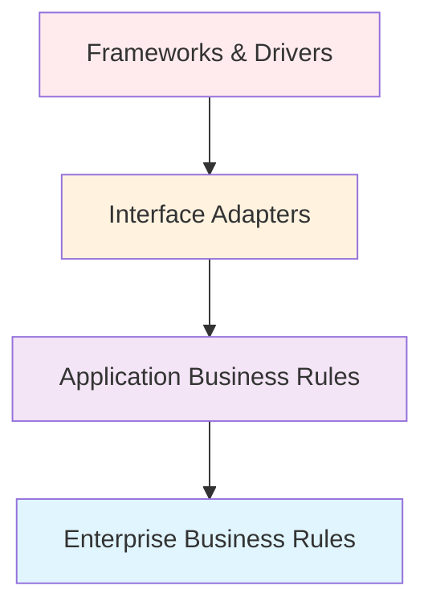
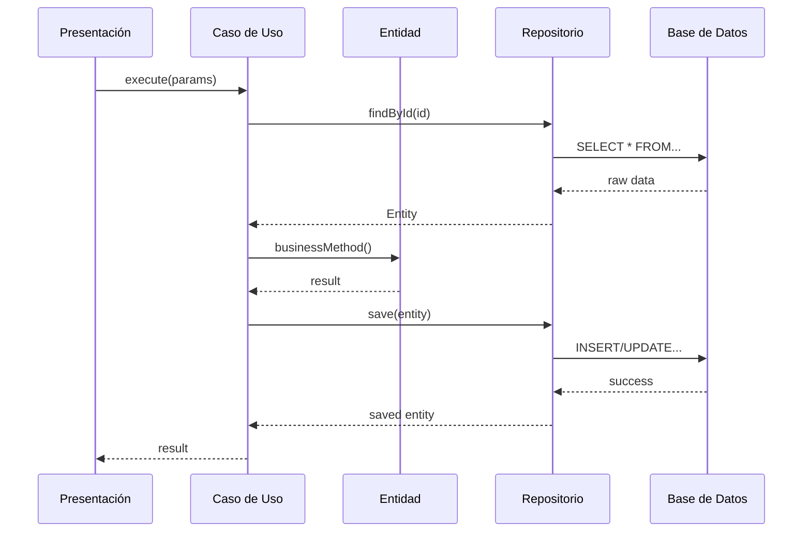

# Arquitectura Limpia

## ¿Qué es la Arquitectura Limpia?

La **Arquitectura Limpia** es un enfoque de diseño de software propuesto por Robert C. Martin que organiza el código en capas concéntricas, donde las dependencias apuntan hacia el centro. El objetivo principal es crear sistemas que sean:

- **Independientes de frameworks**
- **Testeable**
- **Independientes de la UI**
- **Independientes de la base de datos**
- **Independientes de cualquier agente externo**

## 🎯 Principios Fundamentales

### 1. Regla de Dependencia

> **Las dependencias del código fuente solo pueden apuntar hacia adentro**



### 2. Separación de Responsabilidades

Cada capa tiene una responsabilidad específica y bien definida:

| Capa | Responsabilidad | Ejemplos |
|------|----------------|----------|
| **Dominio** | Reglas de negocio empresariales | Entidades, Value Objects |
| **Aplicación** | Reglas de negocio de aplicación | Casos de uso, Interfaces |
| **Infraestructura** | Detalles de implementación | Repositorios, APIs externas |
| **Presentación** | Interfaz con el mundo exterior | Controladores, UI |

### 3. Inversión de Dependencias

Las capas internas definen interfaces que las capas externas implementan:

```typescript
// Dominio define la interfaz
interface IUserRepository {
  findById(id: string): Promise<User | null>;
}

// Infraestructura implementa la interfaz
class PostgreSQLUserRepository implements IUserRepository {
  async findById(id: string): Promise<User | null> {
    // Implementación específica
  }
}
```

## 🏗️ Capas de la Arquitectura

### Capa de Dominio (Centro)

**Responsabilidad**: Contiene las reglas de negocio más importantes y estables.

- **Entidades**: Objetos que encapsulan reglas de negocio empresariales
- **Value Objects**: Objetos inmutables que representan conceptos del dominio
- **Interfaces de Repositorio**: Contratos para acceso a datos

```typescript
export class Book {
  constructor(
    public readonly id: string,
    public readonly title: string,
    // ... otros campos
  ) {}

  isAvailable(): boolean {
    return this.status === BookStatus.AVAILABLE && this.availableCopies > 0;
  }

  requiresPremium(): boolean {
    // Lógica de negocio pura
    return this.isDigital() && this.isNewRelease();
  }
}
```

### Capa de Aplicación

**Responsabilidad**: Orquesta el flujo de datos hacia y desde las entidades.

- **Casos de Uso**: Implementan reglas de negocio específicas de la aplicación
- **Interfaces de Servicios**: Contratos para servicios externos
- **DTOs**: Objetos de transferencia de datos

```typescript
export class BorrowBookUseCase {
  constructor(
    private userRepository: IUserRepository,
    private bookRepository: IBookRepository,
    private loanRepository: ILoanRepository
  ) {}

  async execute(userId: string, bookId: string): Promise<Loan> {
    // Validaciones y lógica de aplicación
    const user = await this.userRepository.findById(userId);
    const book = await this.bookRepository.findById(bookId);
    
    // Aplicar reglas de negocio
    if (!book.isAvailable()) {
      throw new Error('Libro no disponible');
    }
    
    // Crear y persistir el préstamo
    return await this.loanRepository.save(loan);
  }
}
```

### Capa de Infraestructura

**Responsabilidad**: Implementa los detalles técnicos y se comunica con sistemas externos.

- **Repositorios Concretos**: Implementaciones de acceso a datos
- **Servicios Externos**: Integraciones con APIs, email, pagos
- **Configuración**: Base de datos, frameworks

```typescript
export class PostgreSQLBookRepository implements IBookRepository {
  async findById(id: string): Promise<Book | null> {
    // Implementación específica de PostgreSQL
    const result = await this.db.query('SELECT * FROM books WHERE id = $1', [id]);
    return result.rows[0] ? this.mapToEntity(result.rows[0]) : null;
  }
}
```

### Capa de Presentación

**Responsabilidad**: Maneja la interacción con el mundo exterior.

- **Controladores**: Manejan requests HTTP
- **Middleware**: Autenticación, validación, logging
- **Rutas**: Definición de endpoints

```typescript
export class BookController {
  constructor(private searchBooksUseCase: SearchBooksUseCase) {}

  async searchBooks(req: Request, res: Response): Promise<void> {
    try {
      const criteria = this.extractSearchCriteria(req.query);
      const books = await this.searchBooksUseCase.execute(criteria);
      
      res.json({ success: true, data: books });
    } catch (error) {
      res.status(400).json({ success: false, error: error.message });
    }
  }
}
```

## 🔄 Flujo de Datos

El flujo típico de una operación en el sistema sigue este patrón:



## ✅ Beneficios de esta Arquitectura

### 1. **Testabilidad**
- Lógica de negocio aislada y fácil de testear
- Mocking sencillo de dependencias externas

### 2. **Mantenibilidad**
- Cambios en una capa no afectan otras capas
- Código organizado y fácil de entender

### 3. **Flexibilidad**
- Fácil cambio de frameworks o bases de datos
- Nuevas funcionalidades sin romper código existente

### 4. **Escalabilidad**
- Separación clara permite equipos especializados
- Microservicios naturales por bounded contexts

## 🚀 Próximos Pasos

- [**Principios Detallados**](./principles) - Profundiza en los principios SOLID
- [**Capas en Detalle**](./layers) - Análisis profundo de cada capa
- [**Gestión de Dependencias**](./dependencies) - Inyección y inversión de dependencias