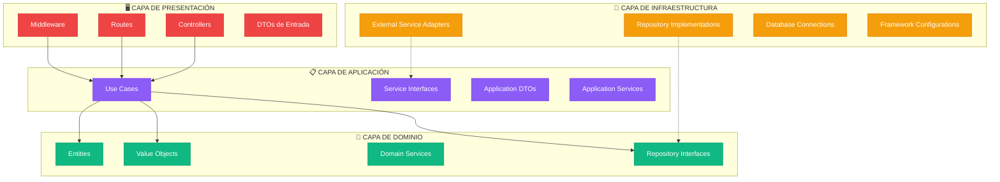
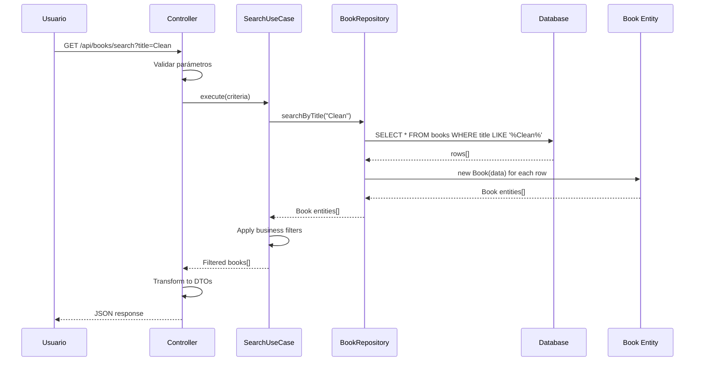

# 🎯 Capas y Responsabilidades

## 🏗️ Organización en Capas Concéntricas

Clean Architecture organiza el código en **capas concéntricas** donde las dependencias apuntan hacia el centro, creando un sistema altamente desacoplado y mantenible.



## 🎯 Capa de Dominio (Centro)

<div class="architecture-card layer-domain">

### 📍 **Ubicación**: Centro de la arquitectura
### 🎯 **Propósito**: Contiene las reglas de negocio más importantes y estables
### 🚫 **Dependencias**: NINGUNA - Es completamente independiente

</div>

### Componentes Principales

#### 1. **Entidades (Entities)**
Objetos que encapsulan las reglas de negocio empresariales más críticas:

```typescript
export class Book {
  constructor(
    public readonly id: string,
    public readonly title: string,
    public readonly author: string,
    // ... otros campos
  ) {}

  // ✅ Reglas de negocio puras
  isAvailable(): boolean {
    return this.status === BookStatus.AVAILABLE && this.availableCopies > 0;
  }

  requiresPremium(): boolean {
    // Lógica de negocio: libros digitales recientes requieren premium
    return this.isDigital() && this.isNewRelease();
  }

  canBeReserved(): boolean {
    return this.availableCopies === 0 && this.status !== BookStatus.MAINTENANCE;
  }
}
```

#### 2. **Value Objects**
Objetos inmutables que representan conceptos del dominio:

```typescript
export class ISBN {
  constructor(private readonly value: string) {
    this.validate(value);
  }

  private validate(isbn: string): void {
    if (!this.isValidISBN(isbn)) {
      throw new Error('ISBN inválido');
    }
  }

  toString(): string {
    return this.value;
  }

  equals(other: ISBN): boolean {
    return this.value === other.value;
  }
}
```

#### 3. **Interfaces de Repositorio**
Contratos que definen cómo acceder a los datos:

```typescript
export interface IBookRepository {
  findById(id: string): Promise<Book | null>;
  save(book: Book): Promise<Book>;
  searchByTitle(title: string): Promise<Book[]>;
}
```

## 📋 Capa de Aplicación

<div class="architecture-card layer-application">

### 📍 **Ubicación**: Rodea al dominio
### 🎯 **Propósito**: Orquesta el flujo de datos hacia y desde las entidades
### ⬇️ **Dependencias**: Solo hacia el dominio

</div>

### Componentes Principales

#### 1. **Casos de Uso (Use Cases)**
Implementan reglas de negocio específicas de la aplicación:

```typescript
export class BorrowBookUseCase {
  constructor(
    private userRepository: IUserRepository,
    private bookRepository: IBookRepository,
    private loanRepository: ILoanRepository
  ) {}

  async execute(userId: string, bookId: string): Promise<Loan> {
    // 1. Obtener y validar entidades
    const user = await this.userRepository.findById(userId);
    const book = await this.bookRepository.findById(bookId);
    
    // 2. Aplicar reglas de negocio del dominio
    if (!user.canBorrowBooks()) {
      throw new Error('Usuario no puede tomar prestados');
    }
    
    if (!book.isAvailable()) {
      throw new Error('Libro no disponible');
    }
    
    // 3. Verificar reglas de aplicación
    if (book.requiresPremium() && !user.isPremium()) {
      throw new Error('Requiere membresía premium');
    }
    
    // 4. Crear y persistir
    const loan = new Loan(/* ... */);
    return await this.loanRepository.save(loan);
  }
}
```

#### 2. **Interfaces de Servicios**
Contratos para servicios externos:

```typescript
export interface INotificationService {
  sendBookAvailableNotification(userId: string, bookTitle: string): Promise<boolean>;
  sendOverdueNotification(userId: string, bookTitle: string, days: number): Promise<boolean>;
}

export interface IPaymentService {
  processPayment(data: PaymentData): Promise<PaymentResult>;
  refundPayment(transactionId: string): Promise<PaymentResult>;
}
```

#### 3. **DTOs de Aplicación**
Objetos para transferir datos entre capas:

```typescript
export interface SearchCriteria {
  title?: string;
  author?: string;
  format?: BookFormat;
  availableOnly?: boolean;
}

export interface LoanResult {
  loanId: string;
  userId: string;
  bookId: string;
  dueDate: Date;
  renewalsLeft: number;
}
```

## 🔧 Capa de Infraestructura

<div class="architecture-card layer-infrastructure">

### 📍 **Ubicación**: Capa externa
### 🎯 **Propósito**: Implementa los detalles técnicos y se comunica con sistemas externos
### ⬇️ **Dependencias**: Hacia aplicación y dominio (a través de interfaces)

</div>

### Componentes Principales

#### 1. **Implementaciones de Repositorio**
Acceso real a datos:

```typescript
export class PostgreSQLBookRepository implements IBookRepository {
  constructor(private db: Database) {}

  async findById(id: string): Promise<Book | null> {
    const query = 'SELECT * FROM books WHERE id = $1';
    const result = await this.db.query(query, [id]);
    
    if (result.rows.length === 0) return null;
    
    return this.mapToEntity(result.rows[0]);
  }

  async save(book: Book): Promise<Book> {
    const query = `
      INSERT INTO books (id, title, author, isbn, format, status, total_copies, available_copies)
      VALUES ($1, $2, $3, $4, $5, $6, $7, $8)
      RETURNING *
    `;
    
    const values = [
      book.id, book.title, book.author, book.isbn,
      book.format, book.status, book.totalCopies, book.availableCopies
    ];
    
    const result = await this.db.query(query, values);
    return this.mapToEntity(result.rows[0]);
  }

  private mapToEntity(row: any): Book {
    return new Book(
      row.id,
      row.title,
      row.author,
      row.isbn,
      row.format,
      row.status,
      row.total_copies,
      row.available_copies
    );
  }
}
```

#### 2. **Adaptadores de Servicios Externos**
Integración con APIs externas:

```typescript
export class EmailNotificationService implements INotificationService {
  constructor(private sendGridClient: SendGridClient) {}

  async sendBookAvailableNotification(userId: string, bookTitle: string): Promise<boolean> {
    try {
      const user = await this.getUserEmail(userId);
      const email = {
        to: user.email,
        from: 'noreply@biblioteca.com',
        subject: 'Libro Disponible',
        html: this.buildBookAvailableTemplate(bookTitle)
      };
      
      await this.sendGridClient.send(email);
      return true;
    } catch (error) {
      console.error('Error sending notification:', error);
      return false;
    }
  }
}
```

#### 3. **Configuraciones de Framework**
Setup de Express, base de datos, etc.:

```typescript
export class DatabaseConfig {
  static async create(): Promise<Database> {
    const config = {
      host: process.env.DB_HOST,
      port: parseInt(process.env.DB_PORT || '5432'),
      database: process.env.DB_NAME,
      user: process.env.DB_USER,
      password: process.env.DB_PASSWORD,
    };
    
    return new Pool(config);
  }
}
```

## 🖥️ Capa de Presentación

<div class="architecture-card layer-presentation">

### 📍 **Ubicación**: Capa más externa
### 🎯 **Propósito**: Maneja la interacción con el mundo exterior
### ⬇️ **Dependencias**: Solo hacia casos de uso de aplicación

</div>

### Componentes Principales

#### 1. **Controladores**
Manejan requests HTTP y coordinan respuestas:

```typescript
export class BookController {
  constructor(
    private searchBooksUseCase: SearchBooksUseCase,
    private borrowBookUseCase: BorrowBookUseCase
  ) {}

  async searchBooks(req: Request, res: Response): Promise<void> {
    try {
      // 1. Extraer y validar parámetros
      const criteria = this.extractSearchCriteria(req.query);
      
      // 2. Ejecutar caso de uso
      const books = await this.searchBooksUseCase.execute(criteria);
      
      // 3. Formatear respuesta
      res.json({
        success: true,
        data: books.map(book => this.toDTO(book)),
        count: books.length
      });
    } catch (error) {
      this.handleError(error, res);
    }
  }

  async borrowBook(req: Request, res: Response): Promise<void> {
    try {
      const { userId, bookId } = req.body;
      
      // Validación básica
      if (!userId || !bookId) {
        res.status(400).json({
          success: false,
          error: 'userId y bookId son requeridos'
        });
        return;
      }

      const loan = await this.borrowBookUseCase.execute(userId, bookId);
      
      res.json({
        success: true,
        data: this.loanToDTO(loan)
      });
    } catch (error) {
      this.handleError(error, res);
    }
  }
}
```

#### 2. **Middleware**
Funcionalidades transversales:

```typescript
export class AuthMiddleware {
  static authenticate(req: Request, res: Response, next: NextFunction): void {
    try {
      const token = this.extractToken(req);
      const payload = this.verifyToken(token);
      
      req.user = payload;
      next();
    } catch (error) {
      res.status(401).json({ error: 'Token inválido' });
    }
  }

  static authorize(roles: UserRole[]) {
    return (req: Request, res: Response, next: NextFunction) => {
      if (!roles.includes(req.user.role)) {
        res.status(403).json({ error: 'Acceso denegado' });
        return;
      }
      next();
    };
  }
}
```

#### 3. **Rutas**
Definición de endpoints:

```typescript
export function createBookRoutes(bookController: BookController): Router {
  const router = Router();
  
  router.get('/search', 
    ValidationMiddleware.validateSearchCriteria,
    (req, res) => bookController.searchBooks(req, res)
  );
  
  router.post('/borrow',
    AuthMiddleware.authenticate,
    ValidationMiddleware.validateBorrowRequest,
    (req, res) => bookController.borrowBook(req, res)
  );
  
  router.post('/reserve',
    AuthMiddleware.authenticate,
    AuthMiddleware.authorize([UserRole.READER]),
    (req, res) => bookController.reserveBook(req, res)
  );
  
  return router;
}
```

## 🔄 Flujo de Datos Entre Capas

### Ejemplo: Búsqueda de Libros



## ✅ Beneficios de esta Organización

### 1. **Separación Clara de Responsabilidades**
- Cada capa tiene un propósito específico
- Fácil localización de funcionalidades
- Cambios aislados y predecibles

### 2. **Testabilidad Excepcional**
- Cada capa se puede testear independientemente
- Mocking sencillo gracias a las interfaces
- Tests rápidos y confiables

### 3. **Flexibilidad Máxima**
- Cambio de frameworks sin afectar lógica de negocio
- Intercambio de bases de datos o servicios externos
- Adaptación a nuevos requerimientos

### 4. **Mantenibilidad a Largo Plazo**
- Código organizado y autodocumentado
- Evolución natural del sistema
- Onboarding rápido de nuevos desarrolladores

## 🚀 Próximos Pasos

- [**Inversión de Dependencias**](./dependencies) - Cómo se implementa la inversión de control
- [**Beneficios**](./benefits) - Ventajas detalladas de Clean Architecture
- [**Implementación**](/implementation/) - Código real por cada capa