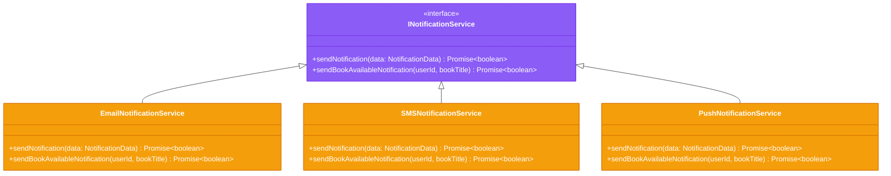
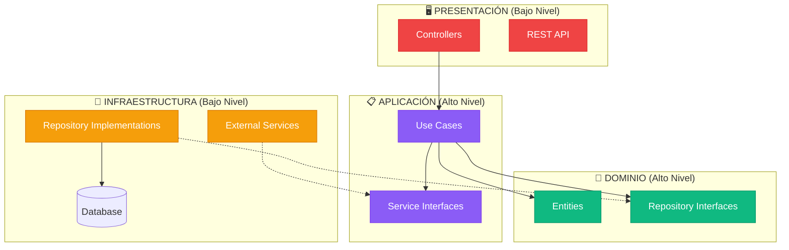

# ⚡ Principios SOLID en Clean Architecture

## 🎯 Los 5 Principios SOLID Aplicados

Clean Architecture se basa fuertemente en los principios SOLID de Robert C. Martin. Veamos cómo se aplican en nuestro sistema de biblioteca digital:

## 🔤 S - Single Responsibility Principle (SRP)

> **"Una clase debe tener una sola razón para cambiar"**

### ✅ Implementación en el Proyecto

<div class="architecture-card layer-domain">

**Entidad User - Una sola responsabilidad**
```typescript
export class User {
  // Solo se encarga de las reglas de negocio del usuario
  isPremium(): boolean {
    return this.membershipType === MembershipType.PREMIUM;
  }

  canBorrowBooks(): boolean {
    return this.isActive;
  }
  
  // NO maneja persistencia, notificaciones, etc.
}
```

</div>

<div class="architecture-card layer-application">

**Caso de Uso - Una operación específica**
```typescript
export class BorrowBookUseCase {
  // Solo se encarga del proceso de préstamo
  async execute(userId: string, bookId: string): Promise<Loan> {
    // Lógica específica de préstamo
  }
  
  // NO maneja búsquedas, reservas, etc.
}
```

</div>

## 🔓 O - Open/Closed Principle (OCP)

> **"Las entidades de software deben estar abiertas para extensión, pero cerradas para modificación"**

### ✅ Implementación con Interfaces



**Extensión sin modificación:**
- Nuevos tipos de notificación sin cambiar código existente
- Casos de uso permanecen inalterados
- Solo se agregan nuevas implementaciones

## 🔄 L - Liskov Substitution Principle (LSP)

> **"Los objetos de una superclase deben ser reemplazables con objetos de sus subclases sin alterar el funcionamiento del programa"**

### ✅ Implementación con Repositorios

```typescript
// Cualquier implementación debe ser intercambiable
interface IBookRepository {
  findById(id: string): Promise<Book | null>;
  save(book: Book): Promise<Book>;
}

// Implementación en memoria (testing)
class InMemoryBookRepository implements IBookRepository {
  async findById(id: string): Promise<Book | null> {
    return this.books.get(id) || null;
  }
}

// Implementación PostgreSQL (producción)
class PostgreSQLBookRepository implements IBookRepository {
  async findById(id: string): Promise<Book | null> {
    const result = await this.db.query('SELECT * FROM books WHERE id = $1', [id]);
    return this.mapToEntity(result.rows[0]);
  }
}

// El caso de uso funciona con cualquier implementación
class BorrowBookUseCase {
  constructor(private bookRepository: IBookRepository) {} // ✅ LSP
}
```

## 🔌 I - Interface Segregation Principle (ISP)

> **"Los clientes no deben ser forzados a depender de interfaces que no usan"**

### ✅ Interfaces Específicas y Cohesivas

<div class="architecture-card layer-application">

**❌ Interfaz Monolítica (Violación ISP)**
```typescript
interface ILibraryService {
  // Operaciones de usuario
  createUser(user: User): Promise<User>;
  updateUser(user: User): Promise<User>;
  
  // Operaciones de libro  
  addBook(book: Book): Promise<Book>;
  searchBooks(criteria: SearchCriteria): Promise<Book[]>;
  
  // Operaciones de préstamo
  borrowBook(userId: string, bookId: string): Promise<Loan>;
  returnBook(loanId: string): Promise<void>;
  
  // Operaciones de pago
  processPayment(payment: PaymentData): Promise<PaymentResult>;
}
```

</div>

<div class="architecture-card layer-application">

**✅ Interfaces Segregadas (Cumple ISP)**
```typescript
interface IUserRepository {
  findById(id: string): Promise<User | null>;
  save(user: User): Promise<User>;
}

interface IBookRepository {
  findById(id: string): Promise<Book | null>;
  searchByTitle(title: string): Promise<Book[]>;
}

interface IPaymentService {
  processPayment(data: PaymentData): Promise<PaymentResult>;
}

// Cada cliente usa solo lo que necesita
class BorrowBookUseCase {
  constructor(
    private userRepository: IUserRepository,    // Solo operaciones de usuario
    private bookRepository: IBookRepository,    // Solo operaciones de libro
    private loanRepository: ILoanRepository     // Solo operaciones de préstamo
  ) {}
}
```

</div>

## 🔄 D - Dependency Inversion Principle (DIP)

> **"Los módulos de alto nivel no deben depender de módulos de bajo nivel. Ambos deben depender de abstracciones"**

### ✅ Inversión Completa de Dependencias



**Configuración de Dependencias (Main/Composition Root):**

```typescript
// index.ts - Único lugar donde se resuelven dependencias
const userRepository: IUserRepository = new PostgreSQLUserRepository();
const bookRepository: IBookRepository = new PostgreSQLBookRepository();
const notificationService: INotificationService = new EmailNotificationService();

const borrowBookUseCase = new BorrowBookUseCase(
  userRepository,      // ✅ Depende de abstracción
  bookRepository,      // ✅ Depende de abstracción  
  loanRepository       // ✅ Depende de abstracción
);

const bookController = new BookController(borrowBookUseCase);
```

## 🎯 Beneficios de Aplicar SOLID

### 1. **Mantenibilidad** 📝
- Cambios localizados y predecibles
- Fácil identificación de responsabilidades
- Código autodocumentado

### 2. **Testabilidad** 🧪
- Mocking sencillo de dependencias
- Tests unitarios aislados
- Cobertura completa de casos de uso

### 3. **Extensibilidad** 🚀
- Nuevas funcionalidades sin romper existentes
- Polimorfismo para variaciones
- Plugin architecture natural

### 4. **Reutilización** ♻️
- Componentes intercambiables
- Abstracciones reutilizables
- Separación clara de concerns

## 🔍 Ejemplo Práctico: Agregar Nueva Funcionalidad

**Requisito:** Agregar notificaciones push sin modificar código existente

<div class="tip custom-block">
<p class="custom-block-title">✅ Solución SOLID</p>

1. **SRP**: Nueva clase `PushNotificationService` con una responsabilidad
2. **OCP**: Implementa `INotificationService` sin modificar casos de uso
3. **LSP**: Es intercambiable con `EmailNotificationService`
4. **ISP**: Usa solo la interfaz de notificaciones necesaria
5. **DIP**: Casos de uso siguen dependiendo de la abstracción

```typescript
// ✅ Nueva implementación sin cambios en código existente
class PushNotificationService implements INotificationService {
  async sendNotification(data: NotificationData): Promise<boolean> {
    // Implementación específica de push notifications
  }
}

// ✅ Configuración en composition root
const notificationService = new PushNotificationService(); // Solo cambio aquí
```

</div>

## 🚀 Próximos Pasos

- [**Capas y Responsabilidades**](./layers) - Organización detallada por capas
- [**Inversión de Dependencias**](./dependencies) - Patrones de inyección
- [**Beneficios**](./benefits) - Ventajas de Clean Architecture