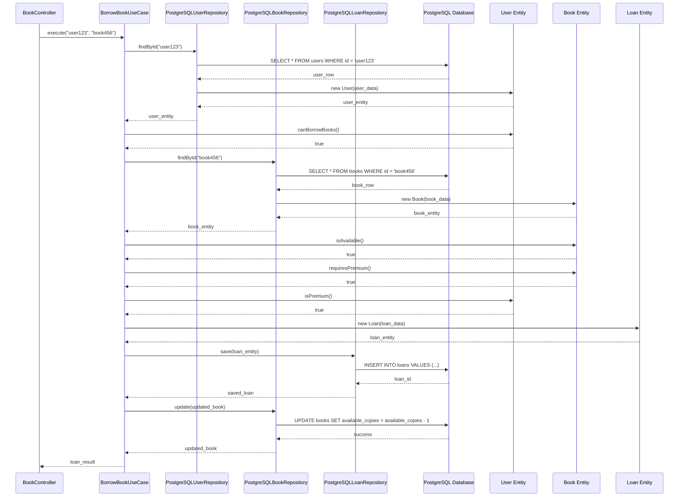

# Nivel 4: Diagrama de Código

## 🎯 Propósito

El nivel de código muestra la estructura detallada de clases, interfaces y sus relaciones dentro de los componentes más importantes del sistema.

**Audiencia**: Desarrolladores que implementan o mantienen el código

## 🏗️ Estructura de Clases por Capa

### Capa de Dominio - Entidades y Reglas de Negocio

```mermaid
classDiagram
    class User {
        -string id
        -string email
        -string name
        -UserRole role
        -MembershipType membershipType
        -Date createdAt
        -boolean isActive
        +isPremium() boolean
        +isAdmin() boolean
        +canBorrowBooks() boolean
    }
    
    class Book {
        -string id
        -string title
        -string author
        -string isbn
        -BookFormat format
        -BookStatus status
        -number totalCopies
        -number availableCopies
        -string digitalUrl
        -Date publishedDate
        +isAvailable() boolean
        +isDigital() boolean
        +canBeReserved() boolean
        +requiresPremium() boolean
    }
    
    class Loan {
        -string id
        -string userId
        -string bookId
        -Date loanDate
        -Date dueDate
        -LoanStatus status
        -Date returnDate
        -number renewalCount
        +isOverdue() boolean
        +canBeRenewed() boolean
        +getDaysUntilDue() number
        +calculateFine() number
    }
    
    class Reservation {
        -string id
        -string userId
        -string bookId
        -Date reservationDate
        -Date expirationDate
        -ReservationStatus status
        -boolean notificationSent
        +isExpired() boolean
        +canBeFulfilled() boolean
        +needsNotification() boolean
        +getDaysUntilExpiration() number
    }
    
    User ||--o{ Loan : "has many"
    User ||--o{ Reservation : "has many"
    Book ||--o{ Loan : "can have many"
    Book ||--o{ Reservation : "can have many"
    
    style User fill:#10b981,stroke:#059669,color:#fff
    style Book fill:#10b981,stroke:#059669,color:#fff
    style Loan fill:#10b981,stroke:#059669,color:#fff
    style Reservation fill:#10b981,stroke:#059669,color:#fff
```

### Capa de Aplicación - Casos de Uso e Interfaces

```mermaid
classDiagram
    class BorrowBookUseCase {
        -IUserRepository userRepository
        -IBookRepository bookRepository
        -ILoanRepository loanRepository
        +execute(userId: string, bookId: string) Promise~Loan~
        -validateUser(user: User) void
        -validateBook(book: Book) void
        -checkLoanLimits(userId: string) void
    }
    
    class SearchBooksUseCase {
        -IBookRepository bookRepository
        +execute(criteria: SearchCriteria) Promise~Book[]~
        -buildSearchQuery(criteria: SearchCriteria) Query
        -sortResults(books: Book[]) Book[]
    }
    
    class ReserveBookUseCase {
        -IUserRepository userRepository
        -IBookRepository bookRepository
        -IReservationRepository reservationRepository
        -INotificationService notificationService
        +execute(userId: string, bookId: string) Promise~Reservation~
        -validateReservationEligibility(user: User, book: Book) void
        -sendConfirmationNotification(reservation: Reservation) void
    }
    
    class IUserRepository {
        <<interface>>
        +findById(id: string) Promise~User | null~
        +findByEmail(email: string) Promise~User | null~
        +save(user: User) Promise~User~
        +update(user: User) Promise~User~
        +delete(id: string) Promise~void~
        +findAll() Promise~User[]~
    }
    
    class IBookRepository {
        <<interface>>
        +findById(id: string) Promise~Book | null~
        +findByIsbn(isbn: string) Promise~Book | null~
        +save(book: Book) Promise~Book~
        +searchByTitle(title: string) Promise~Book[]~
        +searchByAuthor(author: string) Promise~Book[]~
        +findAvailableBooks() Promise~Book[]~
    }
    
    class INotificationService {
        <<interface>>
        +sendNotification(data: NotificationData) Promise~boolean~
        +sendBookAvailableNotification(userId: string, bookTitle: string) Promise~boolean~
        +sendOverdueNotification(userId: string, bookTitle: string, daysOverdue: number) Promise~boolean~
    }
    
    BorrowBookUseCase --> IUserRepository
    BorrowBookUseCase --> IBookRepository
    BorrowBookUseCase --> ILoanRepository
    SearchBooksUseCase --> IBookRepository
    ReserveBookUseCase --> IUserRepository
    ReserveBookUseCase --> IBookRepository
    ReserveBookUseCase --> IReservationRepository
    ReserveBookUseCase --> INotificationService
    
    style BorrowBookUseCase fill:#8b5cf6,stroke:#7c3aed,color:#fff
    style SearchBooksUseCase fill:#8b5cf6,stroke:#7c3aed,color:#fff
    style ReserveBookUseCase fill:#8b5cf6,stroke:#7c3aed,color:#fff
    style IUserRepository fill:#8b5cf6,stroke:#7c3aed,color:#fff
    style IBookRepository fill:#8b5cf6,stroke:#7c3aed,color:#fff
    style INotificationService fill:#8b5cf6,stroke:#7c3aed,color:#fff
```



### Capa de Infraestructura - Implementaciones Concretas

```mermaid
classDiagram
    class PostgreSQLUserRepository {
        -Database db
        -Map~string, User~ cache
        +findById(id: string) Promise~User | null~
        +findByEmail(email: string) Promise~User | null~
        +save(user: User) Promise~User~
        +update(user: User) Promise~User~
        +delete(id: string) Promise~void~
        +findAll() Promise~User[]~
        -mapToEntity(row: any) User
        -mapToRow(user: User) any
    }
    
    class PostgreSQLBookRepository {
        -Database db
        -RedisCache cache
        +findById(id: string) Promise~Book | null~
        +searchByTitle(title: string) Promise~Book[]~
        +searchByAuthor(author: string) Promise~Book[]~
        +findAvailableBooks() Promise~Book[]~
        -buildSearchQuery(criteria: SearchCriteria) string
        -cacheResults(key: string, results: Book[]) void
    }
    
    class EmailNotificationService {
        -SendGridClient client
        -string apiKey
        -string fromEmail
        +sendNotification(data: NotificationData) Promise~boolean~
        +sendBookAvailableNotification(userId: string, bookTitle: string) Promise~boolean~
        +sendOverdueNotification(userId: string, bookTitle: string, daysOverdue: number) Promise~boolean~
        -buildEmailTemplate(type: string, data: any) EmailTemplate
        -sendEmail(to: string, subject: string, content: string) Promise~boolean~
    }
    
    class StripePaymentService {
        -StripeClient stripe
        -string secretKey
        +processPayment(data: PaymentData) Promise~PaymentResult~
        +refundPayment(transactionId: string) Promise~PaymentResult~
        +validatePayment(transactionId: string) Promise~boolean~
        -createPaymentIntent(amount: number, currency: string) Promise~PaymentIntent~
        -handleWebhook(event: StripeEvent) void
    }
    
    class IUserRepository {
        <<interface>>
    }
    
    class IBookRepository {
        <<interface>>
    }
    
    class INotificationService {
        <<interface>>
    }
    
    class IPaymentService {
        <<interface>>
    }
    
    PostgreSQLUserRepository ..|> IUserRepository
    PostgreSQLBookRepository ..|> IBookRepository
    EmailNotificationService ..|> INotificationService
    StripePaymentService ..|> IPaymentService
    
    style PostgreSQLUserRepository fill:#f59e0b,stroke:#d97706,color:#fff
    style PostgreSQLBookRepository fill:#f59e0b,stroke:#d97706,color:#fff
    style EmailNotificationService fill:#f59e0b,stroke:#d97706,color:#fff
    style StripePaymentService fill:#f59e0b,stroke:#d97706,color:#fff
```



### Capa de Presentación - Controladores y API

```mermaid
classDiagram
    class BookController {
        -SearchBooksUseCase searchBooksUseCase
        -BorrowBookUseCase borrowBookUseCase
        -ReserveBookUseCase reserveBookUseCase
        +searchBooks(req: Request, res: Response) Promise~void~
        +borrowBook(req: Request, res: Response) Promise~void~
        +reserveBook(req: Request, res: Response) Promise~void~
        -extractSearchCriteria(query: any) SearchCriteria
        -validateRequest(req: Request) void
        -handleError(error: Error, res: Response) void
    }
    
    class AuthController {
        -AuthService authService
        -IUserRepository userRepository
        +login(req: Request, res: Response) Promise~void~
        +logout(req: Request, res: Response) Promise~void~
        +register(req: Request, res: Response) Promise~void~
        +refreshToken(req: Request, res: Response) Promise~void~
        -generateJWT(user: User) string
        -validateCredentials(email: string, password: string) Promise~User~
    }
    
    class AuthMiddleware {
        -string jwtSecret
        +authenticate(req: Request, res: Response, next: NextFunction) void
        +authorize(roles: UserRole[]) Function
        -verifyToken(token: string) Promise~JWTPayload~
        -extractTokenFromHeader(header: string) string
    }
    
    class ValidationMiddleware {
        +validateSearchCriteria(req: Request, res: Response, next: NextFunction) void
        +validateBorrowRequest(req: Request, res: Response, next: NextFunction) void
        +validateReservationRequest(req: Request, res: Response, next: NextFunction) void
        -sanitizeInput(input: any) any
        -checkRequiredFields(data: any, fields: string[]) void
    }
    
    BookController --> SearchBooksUseCase
    BookController --> BorrowBookUseCase
    BookController --> ReserveBookUseCase
    AuthController --> IUserRepository
    
    style BookController fill:#ef4444,stroke:#dc2626,color:#fff
    style AuthController fill:#ef4444,stroke:#dc2626,color:#fff
    style AuthMiddleware fill:#ef4444,stroke:#dc2626,color:#fff
    style ValidationMiddleware fill:#ef4444,stroke:#dc2626,color:#fff
```



## 🔄 Flujo de Ejecución Detallado

### Ejemplo: Préstamo de Libro Digital



## 📋 Patrones de Diseño Implementados

### 1. Repository Pattern

```typescript
// Abstracción en el dominio
interface IBookRepository {
  findById(id: string): Promise<Book | null>;
}

// Implementación en infraestructura
class PostgreSQLBookRepository implements IBookRepository {
  async findById(id: string): Promise<Book | null> {
    const query = 'SELECT * FROM books WHERE id = $1';
    const result = await this.db.query(query, [id]);
    return result.rows[0] ? this.mapToEntity(result.rows[0]) : null;
  }
  
  private mapToEntity(row: any): Book {
    return new Book(
      row.id,
      row.title,
      row.author,
      // ... mapping logic
    );
  }
}
```

### 2. Use Case Pattern

```typescript
export class BorrowBookUseCase {
  constructor(
    private userRepository: IUserRepository,
    private bookRepository: IBookRepository,
    private loanRepository: ILoanRepository
  ) {}

  async execute(userId: string, bookId: string): Promise<Loan> {
    // 1. Validar usuario
    const user = await this.userRepository.findById(userId);
    this.validateUser(user);
    
    // 2. Validar libro
    const book = await this.bookRepository.findById(bookId);
    this.validateBook(book);
    
    // 3. Aplicar reglas de negocio
    this.checkBusinessRules(user, book);
    
    // 4. Crear y persistir préstamo
    const loan = this.createLoan(userId, bookId);
    return await this.loanRepository.save(loan);
  }
}
```

### 3. Adapter Pattern

```typescript
// Puerto (interfaz en aplicación)
interface INotificationService {
  sendNotification(data: NotificationData): Promise<boolean>;
}

// Adaptador (implementación en infraestructura)
class EmailNotificationService implements INotificationService {
  constructor(private sendGridClient: SendGridClient) {}
  
  async sendNotification(data: NotificationData): Promise<boolean> {
    // Adapta la interfaz interna a la API externa de SendGrid
    const email = this.buildEmail(data);
    return await this.sendGridClient.send(email);
  }
}
```

### 4. Factory Pattern

```typescript
class EntityFactory {
  static createUser(data: UserData): User {
    return new User(
      data.id,
      data.email,
      data.name,
      data.role,
      data.membershipType,
      data.createdAt
    );
  }
  
  static createBook(data: BookData): Book {
    return new Book(
      data.id,
      data.title,
      data.author,
      data.isbn,
      data.format,
      data.status,
      data.totalCopies,
      data.availableCopies
    );
  }
}
```

## 🧪 Estructura de Testing

### Tests Unitarios de Entidades

```typescript
describe('Book Entity', () => {
  describe('isAvailable', () => {
    it('should return true when book is available and has copies', () => {
      const book = new Book(/* ... */);
      expect(book.isAvailable()).toBe(true);
    });
  });
  
  describe('requiresPremium', () => {
    it('should return true for new digital books', () => {
      const book = new Book(/* digital book data */);
      expect(book.requiresPremium()).toBe(true);
    });
  });
});
```

### Tests de Casos de Uso con Mocks

```typescript
describe('BorrowBookUseCase', () => {
  let useCase: BorrowBookUseCase;
  let mockUserRepository: jest.Mocked<IUserRepository>;
  let mockBookRepository: jest.Mocked<IBookRepository>;

  beforeEach(() => {
    mockUserRepository = createMock<IUserRepository>();
    mockBookRepository = createMock<IBookRepository>();
    useCase = new BorrowBookUseCase(mockUserRepository, mockBookRepository);
  });

  it('should successfully borrow an available book', async () => {
    // Arrange
    mockUserRepository.findById.mockResolvedValue(validUser);
    mockBookRepository.findById.mockResolvedValue(availableBook);
    
    // Act
    const result = await useCase.execute('user1', 'book1');
    
    // Assert
    expect(result).toBeDefined();
    expect(mockUserRepository.findById).toHaveBeenCalledWith('user1');
  });
});
```

## 🔧 Configuración de Dependencias

### Composition Root (index.ts)

```typescript
// Configuración de todas las dependencias en un solo lugar
function configureContainer(): Container {
  // Repositorios
  const userRepository = new PostgreSQLUserRepository(database);
  const bookRepository = new PostgreSQLBookRepository(database, cache);
  const loanRepository = new PostgreSQLLoanRepository(database);
  
  // Servicios externos
  const notificationService = new EmailNotificationService(sendGridClient);
  const paymentService = new StripePaymentService(stripeClient);
  
  // Casos de uso
  const borrowBookUseCase = new BorrowBookUseCase(
    userRepository,
    bookRepository,
    loanRepository
  );
  
  // Controladores
  const bookController = new BookController(
    searchBooksUseCase,
    borrowBookUseCase,
    reserveBookUseCase
  );
  
  return {
    bookController,
    // ... otros componentes
  };
}
```

## 🚀 Beneficios de esta Estructura

### 1. **Mantenibilidad**
- Responsabilidades claras por clase
- Fácil localización de funcionalidades
- Cambios aislados y predecibles

### 2. **Testabilidad**
- Mocking sencillo de dependencias
- Tests unitarios rápidos
- Cobertura completa de lógica de negocio

### 3. **Extensibilidad**
- Nuevas implementaciones sin cambiar interfaces
- Polimorfismo para variaciones
- Plugin architecture natural

### 4. **Reutilización**
- Componentes intercambiables
- Abstracciones bien definidas
- Separación clara de concerns

---

Con esta estructura de código detallada, el sistema de biblioteca digital demuestra una implementación completa y profesional de Clean Architecture, siguiendo las mejores prácticas de diseño de software.