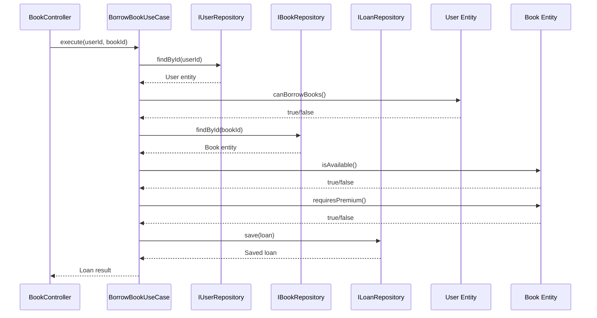
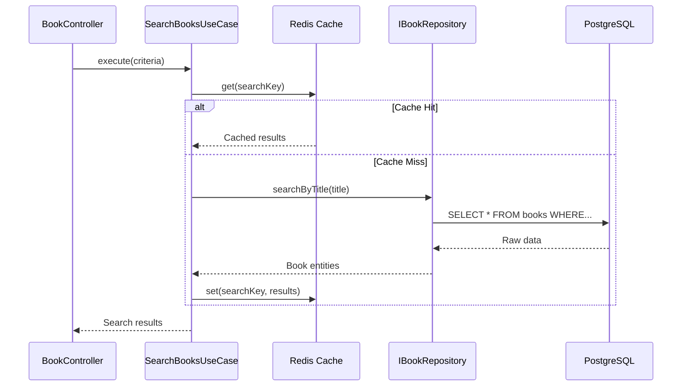

# Nivel 3: Diagrama de Componentes

## 🎯 Propósito

El diagrama de componentes descompone cada **contenedor** en sus componentes individuales, mostrando cómo implementan la lógica de negocio y las interfaces necesarias para la arquitectura limpia.

**Audiencia**: Desarrolladores, arquitectos de software

## 📦 Componentes por Contenedor

### API REST - Componentes Principales

El contenedor de la API REST se descompone en componentes organizados por capas de Clean Architecture:

```mermaid
C4Component
    title API REST - Componentes de Clean Architecture

    Container_Boundary(api, "API REST") {
        Component(authController, "Auth Controller", "Express Controller", "Maneja autenticación y autorización")
        Component(bookController, "Book Controller", "Express Controller", "Maneja operaciones de libros")
        Component(userController, "User Controller", "Express Controller", "Maneja gestión de usuarios")
        
        Component(borrowUseCase, "Borrow Book Use Case", "Application Service", "Orquesta el préstamo de libros")
        Component(searchUseCase, "Search Books Use Case", "Application Service", "Implementa búsqueda de libros")
        Component(reserveUseCase, "Reserve Book Use Case", "Application Service", "Gestiona reservas de libros")
        
        Component(userEntity, "User Entity", "Domain Entity", "Encapsula reglas de negocio de usuarios")
        Component(bookEntity, "Book Entity", "Domain Entity", "Encapsula reglas de negocio de libros")
        Component(loanEntity, "Loan Entity", "Domain Entity", "Encapsula reglas de negocio de préstamos")
        
        Component(userRepo, "User Repository", "Repository Interface", "Define contrato para persistencia de usuarios")
        Component(bookRepo, "Book Repository", "Repository Interface", "Define contrato para persistencia de libros")
        Component(loanRepo, "Loan Repository", "Repository Interface", "Define contrato para persistencia de préstamos")
        
        Component(userRepoImpl, "PostgreSQL User Repository", "Repository Implementation", "Implementa persistencia en PostgreSQL")
        Component(bookRepoImpl, "PostgreSQL Book Repository", "Repository Implementation", "Implementa persistencia en PostgreSQL")
        Component(loanRepoImpl, "PostgreSQL Loan Repository", "Repository Implementation", "Implementa persistencia en PostgreSQL")
        
        Component(notificationService, "Notification Service", "External Service Interface", "Define contrato para notificaciones")
        Component(paymentService, "Payment Service", "External Service Interface", "Define contrato para pagos")
        
        Component(emailAdapter, "Email Adapter", "External Service Implementation", "Implementa envío de emails")
        Component(paymentAdapter, "Payment Adapter", "External Service Implementation", "Implementa procesamiento de pagos")
    }
    
    SystemDb_Ext(database, "PostgreSQL Database", "Base de datos principal")
    System_Ext(emailProvider, "Email Service", "SendGrid/AWS SES")
    System_Ext(paymentProvider, "Payment Gateway", "Stripe")
    
    Rel(bookController, borrowUseCase, "Uses")
    Rel(bookController, searchUseCase, "Uses")
    Rel(bookController, reserveUseCase, "Uses")
    
    Rel(borrowUseCase, userRepo, "Uses")
    Rel(borrowUseCase, bookRepo, "Uses")
    Rel(borrowUseCase, loanRepo, "Uses")
    
    Rel(reserveUseCase, notificationService, "Uses")
    
    Rel(userRepo, userEntity, "Works with")
    Rel(bookRepo, bookEntity, "Works with")
    Rel(loanRepo, loanEntity, "Works with")
    
    Rel(userRepoImpl, userRepo, "Implements")
    Rel(bookRepoImpl, bookRepo, "Implements")
    Rel(loanRepoImpl, loanRepo, "Implements")
    
    Rel(emailAdapter, notificationService, "Implements")
    Rel(paymentAdapter, paymentService, "Implements")
    
    Rel(userRepoImpl, database, "Reads from and writes to")
    Rel(bookRepoImpl, database, "Reads from and writes to")
    Rel(loanRepoImpl, database, "Reads from and writes to")
    
    Rel(emailAdapter, emailProvider, "Sends emails via")
    Rel(paymentAdapter, paymentProvider, "Processes payments via")
```



## 🏗️ Organización por Capas

### Capa de Presentación (Controllers)

#### BookController
- **Responsabilidad**: Maneja requests HTTP relacionados con libros
- **Dependencias**: Casos de uso de aplicación
- **Métodos principales**:
  - `searchBooks()`: Búsqueda de libros
  - `borrowBook()`: Préstamo de libros
  - `reserveBook()`: Reserva de libros

```typescript
export class BookController {
  constructor(
    private searchBooksUseCase: SearchBooksUseCase,
    private borrowBookUseCase: BorrowBookUseCase,
    private reserveBookUseCase: ReserveBookUseCase
  ) {}
}
```

#### AuthController
- **Responsabilidad**: Autenticación y autorización
- **Funcionalidades**:
  - Login/logout
  - Validación de tokens JWT
  - Gestión de sesiones

### Capa de Aplicación (Use Cases)

#### BorrowBookUseCase
- **Responsabilidad**: Orquesta el proceso de préstamo
- **Flujo**:
  1. Validar usuario y permisos
  2. Verificar disponibilidad del libro
  3. Aplicar reglas de negocio
  4. Crear préstamo
  5. Actualizar inventario

```typescript
export class BorrowBookUseCase {
  async execute(userId: string, bookId: string): Promise<Loan> {
    // Validaciones y lógica de orquestación
  }
}
```

#### SearchBooksUseCase
- **Responsabilidad**: Implementa búsqueda con múltiples criterios
- **Características**:
  - Búsqueda por título, autor, género
  - Filtros de disponibilidad y formato
  - Ordenamiento por relevancia

#### ReserveBookUseCase
- **Responsabilidad**: Gestiona el proceso de reserva
- **Incluye**:
  - Validación de elegibilidad
  - Creación de reserva
  - Notificación al usuario

### Capa de Dominio (Entities & Repositories)

#### Entidades de Dominio

**User Entity**
```typescript
export class User {
  isPremium(): boolean { /* lógica */ }
  canBorrowBooks(): boolean { /* lógica */ }
  getMaxLoans(): number { /* lógica */ }
}
```

**Book Entity**
```typescript
export class Book {
  isAvailable(): boolean { /* lógica */ }
  requiresPremium(): boolean { /* lógica */ }
  canBeReserved(): boolean { /* lógica */ }
}
```

**Loan Entity**
```typescript
export class Loan {
  isOverdue(): boolean { /* lógica */ }
  canBeRenewed(): boolean { /* lógica */ }
  calculateFine(): number { /* lógica */ }
}
```

#### Interfaces de Repositorio

```typescript
interface IUserRepository {
  findById(id: string): Promise<User | null>;
  save(user: User): Promise<User>;
  // ... otros métodos
}
```

### Capa de Infraestructura (Implementations)

#### Repositorios Concretos

**PostgreSQLUserRepository**
- Implementa `IUserRepository`
- Maneja queries SQL específicas
- Mapea entre entidades y tablas

**PostgreSQLBookRepository**
- Implementa `IBookRepository`
- Optimiza búsquedas con índices
- Gestiona inventario en tiempo real

#### Adaptadores de Servicios Externos

**EmailNotificationService**
```typescript
export class EmailNotificationService implements INotificationService {
  async sendNotification(data: NotificationData): Promise<boolean> {
    // Integración con SendGrid/AWS SES
  }
}
```

**StripePaymentService**
```typescript
export class StripePaymentService implements IPaymentService {
  async processPayment(data: PaymentData): Promise<PaymentResult> {
    // Integración con Stripe API
  }
}
```

## 🔄 Flujos de Interacción

### Flujo de Préstamo de Libro



### Flujo de Búsqueda con Cache



## 📋 Responsabilidades Detalladas

### Controllers (Presentación)
- **Validación de entrada**: Sanitización y validación básica
- **Serialización**: Conversión entre DTOs y entidades
- **Manejo de errores**: Traducción de excepciones a HTTP status
- **Autenticación**: Verificación de tokens y permisos

### Use Cases (Aplicación)
- **Orquestación**: Coordinación de múltiples repositorios
- **Reglas de aplicación**: Lógica específica del caso de uso
- **Transacciones**: Gestión de consistencia de datos
- **Eventos**: Publicación de eventos de dominio

### Entities (Dominio)
- **Reglas de negocio**: Lógica invariante del dominio
- **Validaciones**: Validaciones de integridad de datos
- **Cálculos**: Operaciones matemáticas del dominio
- **Estado**: Gestión del ciclo de vida de entidades

### Repositories (Infraestructura)
- **Persistencia**: Operaciones CRUD optimizadas
- **Queries**: Consultas complejas y reportes
- **Mapeo**: Conversión entre entidades y modelos de datos
- **Performance**: Optimización de acceso a datos

## 🔧 Patrones Implementados

### Repository Pattern
- Abstrae el acceso a datos
- Permite testing con mocks
- Facilita cambio de tecnología de persistencia

### Dependency Injection
- Inversión de control
- Facilita testing unitario
- Mejora mantenibilidad

### Use Case Pattern
- Encapsula lógica de aplicación
- Facilita reutilización
- Mejora testabilidad

### Adapter Pattern
- Integración con servicios externos
- Desacoplamiento de implementaciones
- Facilita mocking en tests

## 🚀 Próximo Nivel

Para ver los detalles de implementación a nivel de código:

➡️ [**Nivel 4: Código**](./code) - Estructura de clases e interfaces