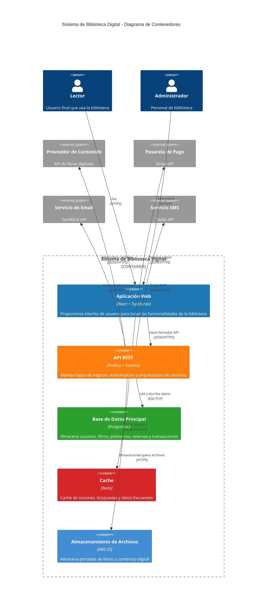
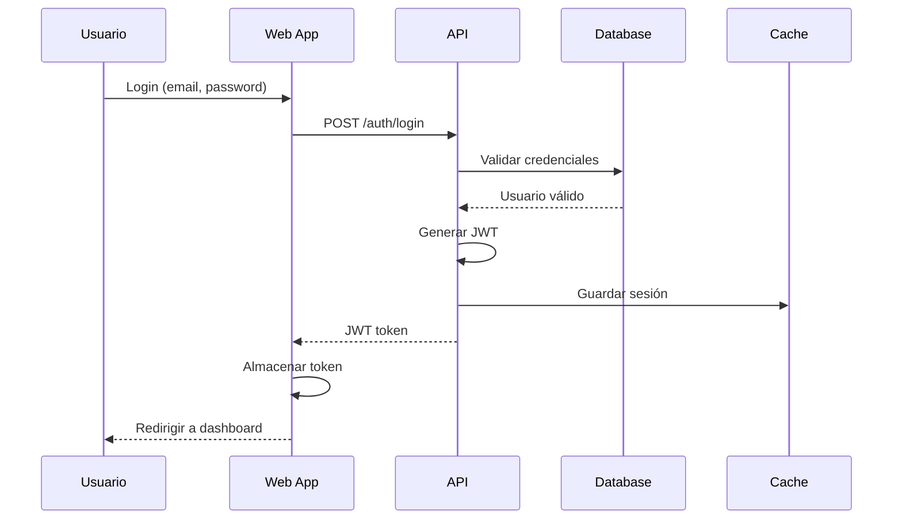
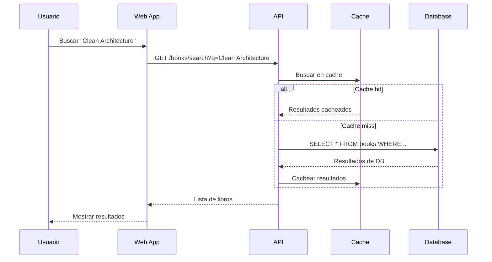
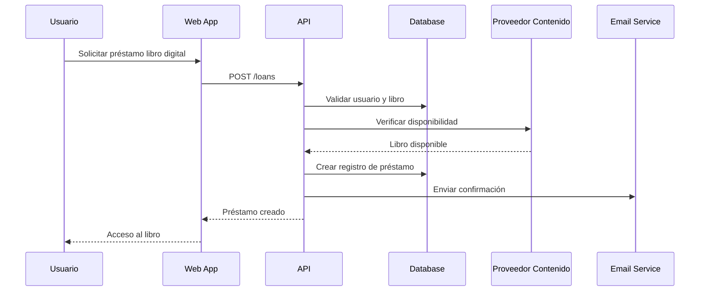

# Nivel 2: Diagrama de Contenedores

## 🎯 Propósito

El diagrama de contenedores descompone el Sistema de Biblioteca Digital en sus principales **contenedores** (aplicaciones, servicios, bases de datos) y muestra cómo se comunican entre sí.

**Audiencia**: Arquitectos de software, desarrolladores senior, DevOps

## 📦 Contenedores del Sistema

### Frontend - Aplicación Web
- **Tecnología**: React + TypeScript + Vite
- **Responsabilidad**: Interfaz de usuario para lectores y administradores
- **Características**:
  - SPA (Single Page Application)
  - Responsive design
  - PWA capabilities
  - Autenticación JWT

### Backend - API REST
- **Tecnología**: Node.js + Express + TypeScript
- **Responsabilidad**: Lógica de negocio y orquestación de servicios
- **Características**:
  - Arquitectura limpia
  - Validación de datos
  - Manejo de errores
  - Rate limiting
  - Logging estructurado

### Base de Datos Principal
- **Tecnología**: PostgreSQL
- **Responsabilidad**: Persistencia de datos principales
- **Esquemas**:
  - Usuarios y membresías
  - Catálogo de libros
  - Préstamos y reservas
  - Transacciones y multas

### Cache Redis
- **Tecnología**: Redis
- **Responsabilidad**: Cache de sesiones y datos frecuentes
- **Uso**:
  - Sesiones de usuario
  - Resultados de búsqueda
  - Datos de libros populares
  - Rate limiting

## 📊 Diagrama de Contenedores



## 🔄 Flujos de Comunicación

### 1. Flujo de Autenticación



### 2. Flujo de Búsqueda de Libros



### 3. Flujo de Préstamo Digital



## 🏗️ Arquitectura de Despliegue

### Desarrollo Local
```
┌─────────────────┐    ┌─────────────────┐
│   Frontend      │    │    Backend      │
│   localhost:3000│◄──►│ localhost:3001  │
└─────────────────┘    └─────────────────┘
                              │
                       ┌─────────────────┐
                       │   PostgreSQL    │
                       │   localhost:5432│
                       └─────────────────┘
```

### Producción (AWS)
```
┌─────────────────┐    ┌─────────────────┐    ┌─────────────────┐
│   CloudFront    │    │   Application   │    │   RDS PostgreSQL│
│   (CDN)         │◄──►│   Load Balancer │◄──►│   (Multi-AZ)    │
└─────────────────┘    └─────────────────┘    └─────────────────┘
                              │
                       ┌─────────────────┐
                       │   ElastiCache   │
                       │   (Redis)       │
                       └─────────────────┘
```

## 📋 Responsabilidades por Contenedor

### Aplicación Web (Frontend)
- **Autenticación**: Login/logout, gestión de tokens
- **Navegación**: Routing, breadcrumbs, menús
- **Búsqueda**: Interfaz de búsqueda avanzada
- **Gestión de Préstamos**: Lista, renovación, devolución
- **Administración**: Paneles para administradores
- **Responsive**: Adaptación a móviles y tablets

### API REST (Backend)
- **Autenticación y Autorización**: JWT, roles, permisos
- **Casos de Uso**: Implementación de lógica de negocio
- **Validación**: Validación de entrada y reglas de negocio
- **Orquestación**: Coordinación de servicios externos
- **Logging y Monitoreo**: Trazabilidad y métricas
- **Rate Limiting**: Protección contra abuso

### Base de Datos Principal
- **Persistencia**: Almacenamiento ACID de datos críticos
- **Integridad**: Constraints y relaciones
- **Performance**: Índices optimizados
- **Backup**: Respaldos automáticos
- **Escalabilidad**: Read replicas para consultas

### Cache (Redis)
- **Sesiones**: Almacenamiento de sesiones de usuario
- **Búsquedas**: Cache de resultados frecuentes
- **Rate Limiting**: Contadores de requests
- **Pub/Sub**: Notificaciones en tiempo real

## 🔒 Consideraciones de Seguridad

### Autenticación y Autorización
- **JWT Tokens**: Stateless authentication
- **RBAC**: Role-based access control
- **HTTPS**: Encriptación en tránsito
- **CORS**: Configuración restrictiva

### Protección de Datos
- **Encriptación**: Datos sensibles en DB
- **Sanitización**: Prevención de SQL injection
- **Rate Limiting**: Protección contra DDoS
- **Audit Logs**: Trazabilidad de acciones

## 📊 Métricas y Monitoreo

### Métricas de Aplicación
- **Response Time**: Latencia de API endpoints
- **Throughput**: Requests por segundo
- **Error Rate**: Porcentaje de errores
- **User Sessions**: Usuarios activos

### Métricas de Infraestructura
- **CPU/Memory**: Utilización de recursos
- **Database**: Conexiones, query performance
- **Cache**: Hit ratio, memory usage
- **Network**: Bandwidth, latency

## 🚀 Próximo Nivel

Con la arquitectura de contenedores clara, podemos profundizar en los componentes internos:

➡️ [**Nivel 3: Componentes**](./components) - Componentes dentro de cada contenedor