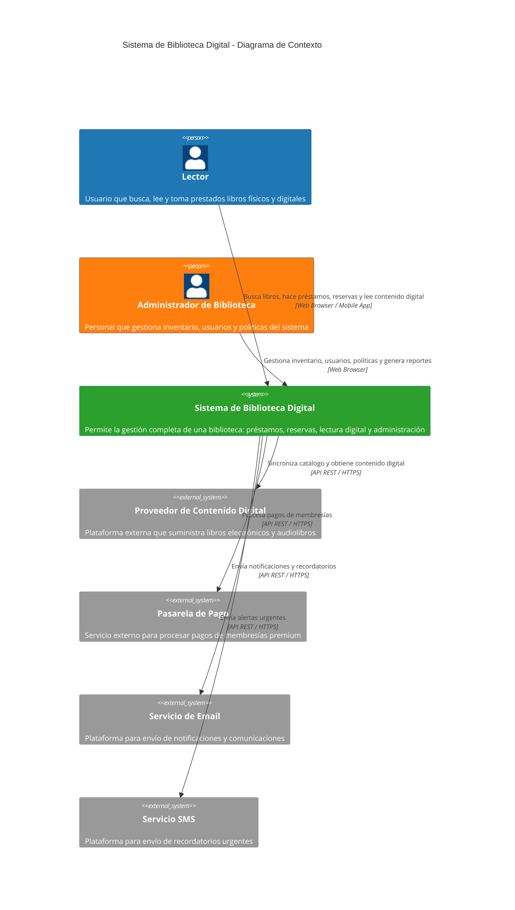
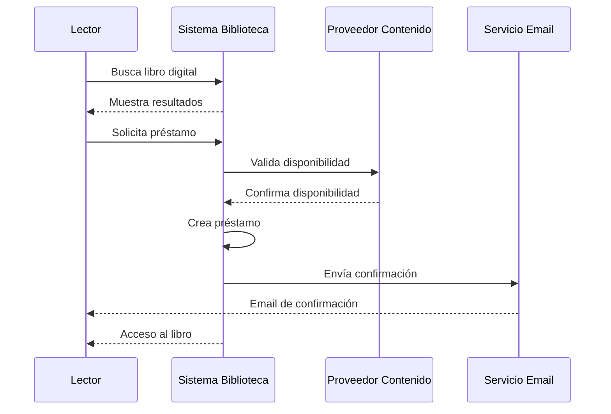
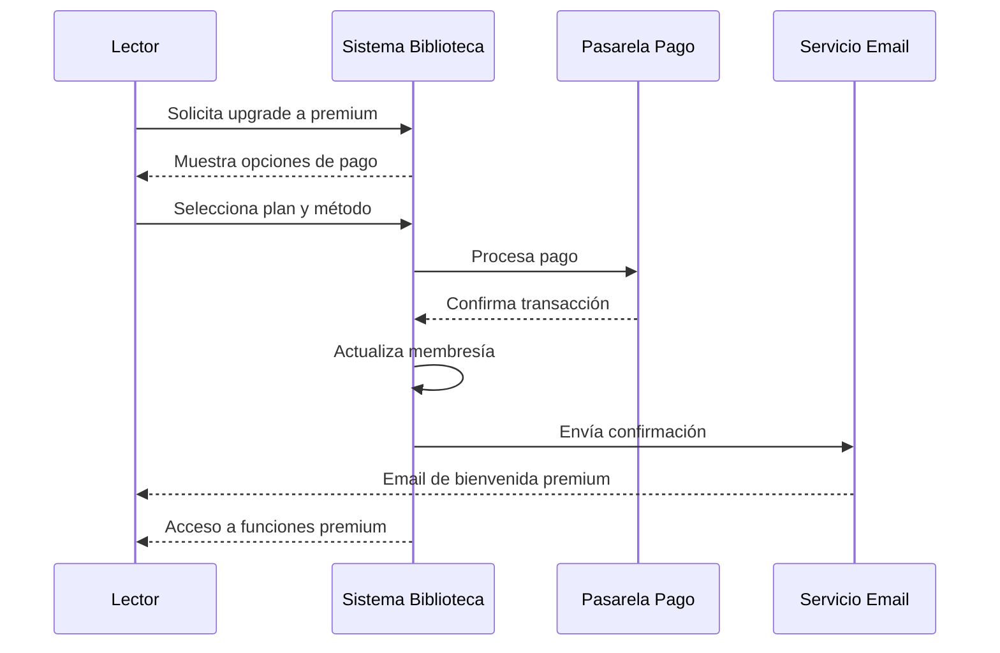

# Nivel 1: Diagrama de Contexto del Sistema

## 🎯 Propósito

El diagrama de contexto muestra el **Sistema de Biblioteca Digital** como una caja negra, enfocándose en las personas que lo usan y los sistemas externos con los que interactúa.

**Audiencia**: Todos los stakeholders (técnicos y no técnicos)

## 👥 Actores Principales

### Lectores (Usuarios Finales)
- **Rol**: Usuarios que consumen contenido de la biblioteca
- **Actividades**:
  - Buscar libros por título, autor o género
  - Leer libros digitales en línea
  - Tomar libros prestados (físicos y digitales)
  - Reservar libros no disponibles
  - Ver historial de préstamos
  - Recibir notificaciones

### Administradores
- **Rol**: Personal de la biblioteca que gestiona el sistema
- **Actividades**:
  - Gestionar inventario de libros
  - Administrar usuarios y membresías
  - Configurar políticas de préstamo
  - Generar reportes
  - Gestionar reservas y multas

## 🔗 Sistemas Externos

### Proveedor de Contenido Digital
- **Propósito**: Suministra libros en formato digital
- **Interacción**: 
  - Sincronización de catálogo
  - Descarga de contenido
  - Validación de licencias
- **Ejemplos**: OverDrive, Hoopla, bibliotecas digitales

### Pasarela de Pago
- **Propósito**: Procesa pagos de membresías premium
- **Interacción**:
  - Procesamiento de pagos
  - Validación de transacciones
  - Gestión de reembolsos
- **Ejemplos**: Stripe, PayPal, Square

### Servicio de Notificaciones
- **Propósito**: Envía comunicaciones a los usuarios
- **Interacción**:
  - Notificaciones por email
  - SMS para recordatorios urgentes
  - Push notifications (futuro)
- **Ejemplos**: SendGrid, AWS SES, Twilio

## 📊 Diagrama de Contexto

## 🔄 Flujos de Interacción Principales

### 1. Flujo de Préstamo de Libro Digital

### 2. Flujo de Pago de Membresía Premium

## 📋 Casos de Uso Principales

### Para Lectores
1. **Búsqueda de Libros**: Encontrar libros por múltiples criterios
2. **Préstamo Digital**: Acceder a libros electrónicos
3. **Préstamo Físico**: Reservar libros físicos para recoger
4. **Gestión de Reservas**: Ver y cancelar reservas activas
5. **Historial Personal**: Consultar préstamos anteriores
6. **Upgrade de Membresía**: Acceder a funciones premium

### Para Administradores
1. **Gestión de Inventario**: Agregar, editar y eliminar libros
2. **Administración de Usuarios**: Gestionar cuentas y membresías
3. **Configuración de Políticas**: Definir reglas de préstamo
4. **Reportes y Analytics**: Generar estadísticas de uso
5. **Gestión de Multas**: Administrar pagos y penalizaciones

## 🎯 Objetivos del Sistema

### Objetivos de Negocio
- **Aumentar el acceso** a recursos bibliotecarios
- **Modernizar** la experiencia del usuario
- **Optimizar** la gestión de recursos
- **Generar ingresos** a través de membresías premium

### Objetivos Técnicos
- **Escalabilidad** para miles de usuarios concurrentes
- **Disponibilidad** 24/7 con mínimo downtime
- **Seguridad** de datos personales y transacciones
- **Integración** fluida con sistemas externos

## 🚀 Próximo Nivel

Una vez entendido el contexto general, podemos profundizar en la arquitectura interna:

➡️ [**Nivel 2: Contenedores**](./containers) - Arquitectura de alto nivel del sistema