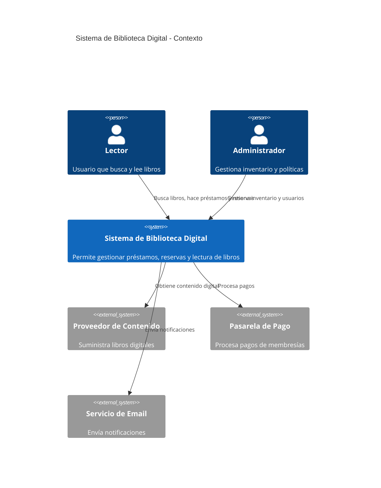
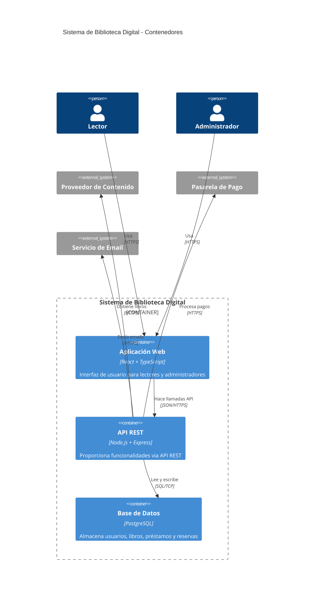

# Modelo C4 - Documentación de Arquitectura

## ¿Qué es el Modelo C4?

El **Modelo C4** es un enfoque para visualizar la arquitectura de software creado por Simon Brown. Proporciona una forma jerárquica de documentar la arquitectura en 4 niveles de abstracción:

1. **Contexto** - Vista de alto nivel del sistema
2. **Contenedores** - Aplicaciones y servicios principales
3. **Componentes** - Módulos dentro de cada contenedor
4. **Código** - Clases e interfaces (opcional)

## 🎯 Beneficios del Modelo C4

- **Comunicación clara** entre stakeholders técnicos y no técnicos
- **Documentación viva** que evoluciona con el sistema
- **Diferentes niveles de detalle** según la audiencia
- **Estándar visual** fácil de entender

## 📊 Niveles de Abstracción

### Nivel 1: Diagrama de Contexto del Sistema
**Audiencia**: Todos los stakeholders
**Propósito**: Mostrar cómo el sistema encaja en el mundo

### Nivel 2: Diagrama de Contenedores
**Audiencia**: Arquitectos y desarrolladores
**Propósito**: Mostrar la arquitectura de alto nivel y responsabilidades

### Nivel 3: Diagrama de Componentes
**Audiencia**: Desarrolladores
**Propósito**: Mostrar los componentes dentro de cada contenedor

### Nivel 4: Diagrama de Código
**Audiencia**: Desarrolladores
**Propósito**: Mostrar clases e interfaces importantes

## 🏗️ Mapeo con Arquitectura Limpia

El Modelo C4 se alinea perfectamente con Clean Architecture:

| Nivel C4 | Capa Clean Architecture | Descripción |
|----------|------------------------|-------------|
| **Contexto** | Sistema Completo | Vista externa del sistema |
| **Contenedores** | Capas Principales | Presentación, Aplicación, Infraestructura |
| **Componentes** | Módulos por Capa | Casos de uso, Entidades, Repositorios |
| **Código** | Implementación | Clases, Interfaces, Métodos |

## 📋 Convenciones Visuales

### Colores Estándar
- **Azul**: Personas (usuarios del sistema)
- **Verde**: Sistemas internos
- **Gris**: Sistemas externos
- **Amarillo**: Contenedores/Aplicaciones

### Formas
- **Rectángulos**: Sistemas y contenedores
- **Cilindros**: Bases de datos
- **Círculos**: Personas
- **Flechas**: Relaciones y flujo de datos

## 🚀 Navegación por Niveles

Explora cada nivel del modelo C4 aplicado a nuestro sistema:

- [**Nivel 1: Contexto**](./context) - Vista general del sistema
- [**Nivel 2: Contenedores**](./containers) - Arquitectura de alto nivel
- [**Nivel 3: Componentes**](./components) - Componentes por contenedor
- [**Nivel 4: Código**](./code) - Estructura de clases

---

*"Un diagrama vale más que mil palabras, pero solo si está en el nivel correcto de abstracción para su audiencia."* - **Simon Brown**