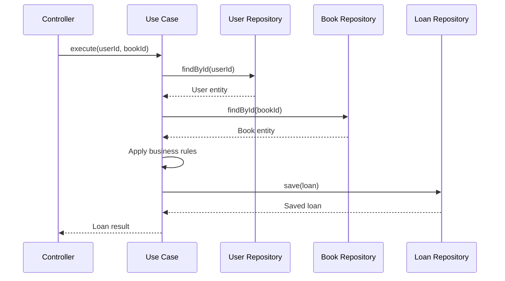

# Implementación del Sistema

## 🏗️ Estructura del Proyecto

El proyecto está organizado siguiendo los principios de **Arquitectura Limpia**, donde cada capa tiene responsabilidades específicas y las dependencias apuntan hacia el centro.

```
src/
├── domain/                 # 🎯 Capa de Dominio (Centro)
│   ├── entities/          # Entidades de negocio
│   │   ├── User.ts
│   │   ├── Book.ts
│   │   ├── Loan.ts
│   │   └── Reservation.ts
│   └── repositories/      # Interfaces de repositorios
│       ├── IUserRepository.ts
│       ├── IBookRepository.ts
│       ├── ILoanRepository.ts
│       └── IReservationRepository.ts
│
├── application/           # 📋 Capa de Aplicación
│   ├── use-cases/        # Casos de uso
│   │   ├── BorrowBookUseCase.ts
│   │   ├── SearchBooksUseCase.ts
│   │   └── ReserveBookUseCase.ts
│   └── interfaces/       # Interfaces de servicios
│       ├── INotificationService.ts
│       ├── IPaymentService.ts
│       └── IDigitalContentProvider.ts
│
├── infrastructure/       # 🔧 Capa de Infraestructura
│   ├── repositories/     # Implementaciones de repositorios
│   │   ├── PostgreSQLUserRepository.ts
│   │   ├── PostgreSQLBookRepository.ts
│   │   ├── PostgreSQLLoanRepository.ts
│   │   └── PostgreSQLReservationRepository.ts
│   └── external-services/ # Servicios externos
│       ├── EmailNotificationService.ts
│       └── StripePaymentService.ts
│
└── presentation/         # 🖥️ Capa de Presentación
    ├── controllers/      # Controladores HTTP
    │   └── BookController.ts
    ├── routes/          # Definición de rutas
    └── middleware/      # Middleware de Express
```

## 🎯 Principios Aplicados

### 1. Inversión de Dependencias

Las capas internas definen interfaces que las externas implementan:

```typescript
// Dominio define la interfaz
interface IUserRepository {
  findById(id: string): Promise<User | null>;
}

// Infraestructura implementa
class PostgreSQLUserRepository implements IUserRepository {
  async findById(id: string): Promise<User | null> {
    // Implementación específica
  }
}

// Aplicación usa la interfaz
class BorrowBookUseCase {
  constructor(private userRepository: IUserRepository) {}
}
```

### 2. Separación de Responsabilidades

Cada capa tiene una responsabilidad clara:

- **Dominio**: Reglas de negocio puras
- **Aplicación**: Orquestación de casos de uso
- **Infraestructura**: Detalles técnicos
- **Presentación**: Interfaz con el exterior

### 3. Inyección de Dependencias

Las dependencias se inyectan desde la capa de configuración:

```typescript
// Configuración en index.ts
const userRepository = new PostgreSQLUserRepository();
const bookRepository = new PostgreSQLBookRepository();
const loanRepository = new PostgreSQLLoanRepository();

const borrowBookUseCase = new BorrowBookUseCase(
  userRepository,
  bookRepository,
  loanRepository
);

const bookController = new BookController(borrowBookUseCase);
```

## 🔄 Flujo de Datos

### Ejemplo: Préstamo de Libro



## 📋 Casos de Uso Implementados

### 1. BorrowBookUseCase
**Responsabilidad**: Gestionar el préstamo de libros

**Validaciones**:
- Usuario existe y puede tomar prestados
- Libro existe y está disponible
- Verificar límites de préstamos
- Validar membresía premium si es requerida

```typescript
async execute(userId: string, bookId: string): Promise<Loan> {
  // Validaciones de negocio
  const user = await this.userRepository.findById(userId);
  const book = await this.bookRepository.findById(bookId);
  
  if (!book.isAvailable()) {
    throw new Error('Libro no disponible');
  }
  
  // Crear préstamo y actualizar disponibilidad
  return await this.loanRepository.save(loan);
}
```

### 2. SearchBooksUseCase
**Responsabilidad**: Búsqueda de libros con múltiples criterios

**Características**:
- Búsqueda por título, autor, formato
- Filtros de disponibilidad
- Ordenamiento por relevancia

### 3. ReserveBookUseCase
**Responsabilidad**: Gestionar reservas de libros

**Funcionalidades**:
- Validar que el libro necesita reserva
- Crear reserva con fecha de expiración
- Enviar notificación de confirmación

## 🏛️ Entidades de Dominio

### User Entity
```typescript
export class User {
  isPremium(): boolean {
    return this.membershipType === MembershipType.PREMIUM;
  }

  canBorrowBooks(): boolean {
    return this.isActive;
  }
}
```

### Book Entity
```typescript
export class Book {
  isAvailable(): boolean {
    return this.status === BookStatus.AVAILABLE && this.availableCopies > 0;
  }

  requiresPremium(): boolean {
    return this.isDigital() && this.isNewRelease();
  }
}
```

### Loan Entity
```typescript
export class Loan {
  isOverdue(): boolean {
    return this.status === LoanStatus.ACTIVE && new Date() > this.dueDate;
  }

  calculateFine(): number {
    if (!this.isOverdue()) return 0;
    const overdueDays = Math.abs(this.getDaysUntilDue());
    return overdueDays * 0.50;
  }
}
```

## 🔧 Servicios de Infraestructura

### EmailNotificationService
```typescript
export class EmailNotificationService implements INotificationService {
  async sendBookAvailableNotification(userId: string, bookTitle: string): Promise<boolean> {
    // Implementación con SendGrid/AWS SES
  }
}
```

### StripePaymentService
```typescript
export class StripePaymentService implements IPaymentService {
  async processPayment(paymentData: PaymentData): Promise<PaymentResult> {
    // Integración con Stripe API
  }
}
```

## 🚀 Configuración y Ejecución

### Instalación
```bash
npm install
```

### Desarrollo
```bash
npm run dev
```

### Construcción
```bash
npm run build
```

### Pruebas
```bash
npm test
```

## 📊 API Endpoints

### Búsqueda de Libros
```http
GET /api/books/search?title=Clean&author=Martin&availableOnly=true
```

### Préstamo de Libro
```http
POST /api/books/borrow
Content-Type: application/json

{
  "userId": "123",
  "bookId": "456"
}
```

### Reserva de Libro
```http
POST /api/books/reserve
Content-Type: application/json

{
  "userId": "123",
  "bookId": "789"
}
```

## 🔍 Próximas Secciones

Explora los detalles de implementación por capa:

- [**Dominio**](./domain) - Entidades y reglas de negocio
- [**Aplicación**](./application) - Casos de uso y orquestación
- [**Infraestructura**](./infrastructure) - Implementaciones concretas
- [**Presentación**](./presentation) - Controladores y API