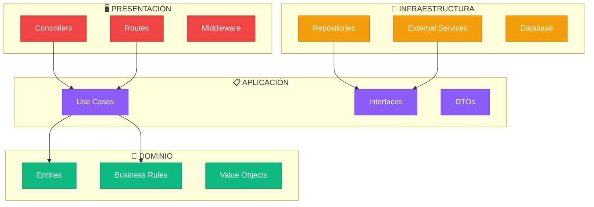
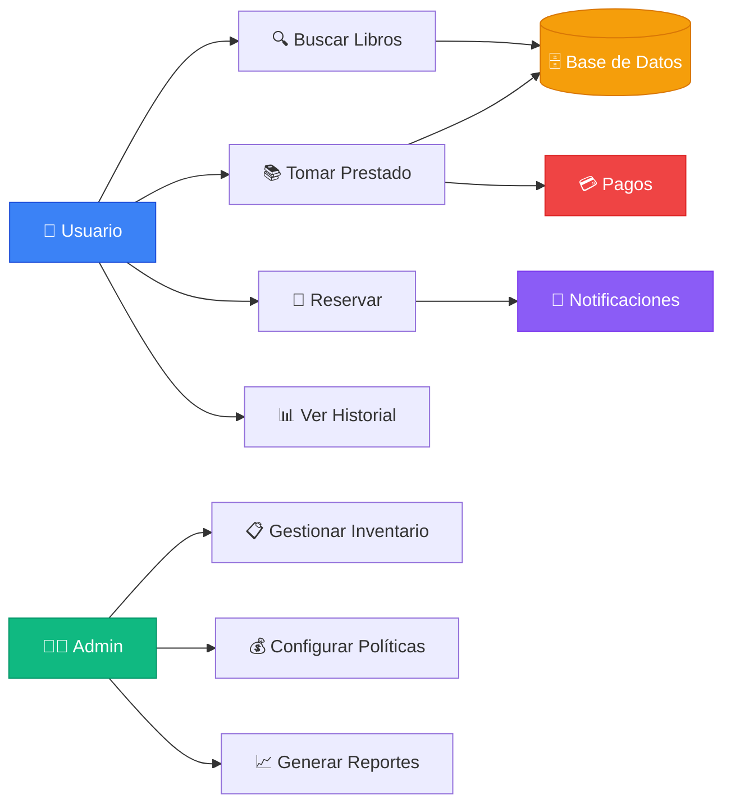

## 🎯 Objetivo del Proyecto

Este proyecto demuestra la **implementación práctica** de los principios de **Arquitectura Limpia** (Clean Architecture) de Robert C. Martin en un sistema real de gestión de bibliotecas digitales.

### 📚 Funcionalidades Principales

- **Búsqueda y lectura** de libros en línea
- **Gestión de préstamos** (físicos y digitales)
- **Sistema de reservas** con notificaciones
- **Historial completo** de préstamos
- **Membresías premium** con beneficios
- **Portal administrativo** para gestión
- **API pública** para integraciones
- **Servicios externos** (pagos, email, contenido)

## 🏗️ Arquitectura en Capas Concéntricas

El sistema implementa **Clean Architecture** con dependencias que apuntan hacia el centro:

## 📋 Principios de Clean Architecture Implementados

💡 Regla de Dependencia

**Las dependencias del código fuente solo pueden apuntar hacia adentro**

Cada capa solo puede depender de capas más internas, nunca de las externas.

### 🎯 **Capa de Dominio** CORE

- **Entidades**: `User`, `Book`, `Loan`, `Reservation`
- **Reglas de negocio**: Validaciones y lógica invariante
- **Interfaces**: Contratos para repositorios
- **Sin dependencias externas**

### 📋 **Capa de Aplicación** USE CASES

- **Casos de uso**: `BorrowBookUseCase`, `SearchBooksUseCase`
- **Orquestación**: Coordinación de entidades y servicios
- **Interfaces de servicios**: Contratos para servicios externos
- **DTOs**: Objetos de transferencia de datos

### 🔧 **Capa de Infraestructura** ADAPTERS

- **Repositorios**: Implementaciones de persistencia
- **Servicios externos**: Email, pagos, contenido digital
- **Base de datos**: PostgreSQL, Redis
- **Frameworks**: Express, TypeScript

### 🖥️ **Capa de Presentación** UI/API

- **Controladores**: Manejo de requests HTTP
- **Rutas**: Definición de endpoints
- **Middleware**: Autenticación, validación
- **Serialización**: Conversión de datos

## 🚀 Stack Tecnológico

| Capa | Tecnología | Propósito |
|------|------------|----------|
| **Backend** | Node.js + TypeScript + Express | API REST y lógica de negocio |
| **Base de Datos** | PostgreSQL + Redis | Persistencia y cache |
| **Testing** | Jest + Supertest | Tests unitarios e integración |
| **Documentación** | VitePress + Mermaid | Documentación técnica |
| **CI/CD** | GitHub Actions | Despliegue automático |
| **Servicios** | Stripe + SendGrid + AWS S3 | Pagos, email y almacenamiento |

## 🗺️ Navegación por la Documentación

### 🏛️ [Arquitectura Limpia](/architecture/)
Principos SOLID, capas, inversión de dependencias y beneficios de Clean Architecture

### 📊 [Modelo C4](/c4-model/)
Documentación arquitectónica en 4 niveles: Contexto → Contenedores → Componentes → Código

### 💻 [Implementación](/implementation/)
Detalles técnicos, estructura del proyecto y código por capas

### 🧪 [Testing](/implementation/testing)
Tests unitarios, mocks y cobertura de casos de uso

## 🎓 Casos de Uso Implementados

## 🎯 Beneficios Demostrados

::: tip ✅ **MANTENIBILIDAD**
Código organizado por responsabilidades, fácil de modificar y extender
:::

::: info 🧪 **TESTABILIDAD**  
Lógica de negocio aislada, mocking sencillo, tests rápidos y confiables
:::

::: warning 🚀 **ESCALABILIDAD**
Separación clara permite equipos especializados y crecimiento natural
:::

::: danger 🔄 **FLEXIBILIDAD**
Cambio de frameworks, bases de datos o servicios sin afectar el core
:::

---

*"La arquitectura de software es el arte de dibujar líneas que llamo límites. Esos límites separan los elementos de software unos de otros, y restringen a aquellos de un lado a conocer sobre aquellos del otro lado."*

**— Robert C. Martin (Uncle Bob)**

## 🚀 Próximos Pasos

1. **[Explorar la Arquitectura](/architecture/)** - Entiende los principios fundamentales
2. **[Revisar el Modelo C4](/c4-model/)** - Visualiza la arquitectura en 4 niveles  
3. **[Analizar la Implementación](/implementation/)** - Examina el código por capas
4. **[Ejecutar el Proyecto](https://github.com/tu-usuario/biblioteca-digital-clean-architecture)** - Clona y ejecuta localmente